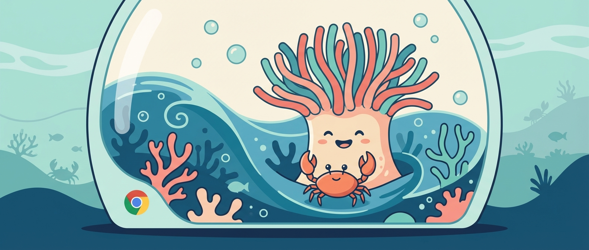

# 🌊 Anemone

<p align="center">
  
</p>

<p align="center">
  <em>Like the sea anemone that shields its host, Anemone protects your AI agent's browser from detection.</em>
</p>

<p align="center">
  <strong>Headful Chrome + noVNC + Anti-Detection + Security Hardening</strong><br>
  For Docker containers. Free and open source.
</p>

---

## What is Anemone?

Anemone gives your AI agent a **real browser** inside a Docker container that doesn't get blocked by Google, Cloudflare, or other anti-bot systems.

- 🐟 **Anti-detection** — Headful Chrome via Xvfb, no "HeadlessChrome" fingerprint
- 🖥️ **Human VNC access** — Web-based noVNC with SSL + password for manual intervention
- 🤖 **AI agent automation** — Chrome DevTools Protocol (CDP) for programmatic control
- 🔒 **Security hardened** — Chrome Policy blocks `file://`, extensions, DevTools
- 📦 **One script** — No Docker Compose, no Kubernetes, just `bash start.sh`
- 🔄 **Persistent profile** — Cookies and sessions survive restarts

## Why?

Headless Chrome in Docker gets blocked because of:
- `HeadlessChrome` in User-Agent → instant detection
- `navigator.webdriver = true` → bot fingerprint
- Missing GPU/font/plugin fingerprints

**Anemone solves this** by running Chrome in headful mode inside a virtual display, with anti-detection flags and a persistent profile.

## Quick Start

```bash
# 1. Install (once per container)
docker cp setup.sh <container>:/tmp/
docker cp start.sh <container>:/tmp/
docker exec <container> bash /tmp/setup.sh

# 2. Start
docker exec <container> bash /root/start.sh
# Output: https://<IP>:6080/vnc.html?password=<random>&autoconnect=true&resize=scale
```

## Access

**Human (web browser):**
```
https://<IP>:<PORT>/vnc.html?password=<PASS>&autoconnect=true&resize=scale
```

**AI agent (CDP inside container):**
```python
import json, urllib.request
info = json.loads(urllib.request.urlopen("http://127.0.0.1:9222/json/version").read())
```

## Configuration

```bash
bash /root/start.sh [password] [novnc_port] [cdp_port] [resolution]

# Examples:
bash /root/start.sh                              # Random password, defaults
bash /root/start.sh "mypass123"                   # Custom password
bash /root/start.sh "mypass123" 6080 9222         # Custom ports
bash /root/start.sh "" 6080 9222 1920x1080x24     # Custom resolution
```

## Architecture

```
 You (browser)                        AI Agent
      │                                   │
      │ HTTPS/WSS (SSL + password)        │ CDP (localhost only)
      ▼                                   ▼
 ┌─────────────────────────────────────────────┐
 │  Anemone Container                          │
 │                                             │
 │  websockify:6080 ──► x11vnc:5900            │
 │                          │                  │
 │                     Xvfb :99                │
 │                          │                  │
 │                   Chrome (headful)          │
 │                     CDP :9222               │
 │                          │                  │
 │               /root/.chrome-profile         │
 │              (persistent cookies)           │
 └─────────────────────────────────────────────┘
```

## Security

| Layer | Protection |
|-------|-----------|
| noVNC | SSL + random 14-char password |
| CDP | localhost only, not exposed |
| Chrome Policy | `file://` blocked, extensions blocked, DevTools disabled |
| Container | Docker isolation from host |

Even if an attacker breaks the VNC password, they can only browse the web inside the container — no file access, no host access.

## Tested Environments

| Server | IP Type | Google Search | Google Scholar |
|--------|---------|:------------:|:--------------:|
| Home server (Taiwan) | Residential | ✅ | ✅ |
| OVH (France) | Datacenter | ✅ | ✅ |

## Companion to OpenClaw

Anemone is designed to work with [OpenClaw](https://github.com/openclaw/openclaw) AI agents. Add to your OpenClaw config:

```json
{
  "browser": {
    "headless": false,
    "noSandbox": true,
    "executablePath": "/usr/bin/google-chrome-stable"
  }
}
```

## Files

| File | Purpose |
|------|---------|
| `setup.sh` | One-time dependency install |
| `start.sh` | Start environment (idempotent) |
| `test.py` | Test Google/Scholar access |

## License

MIT
